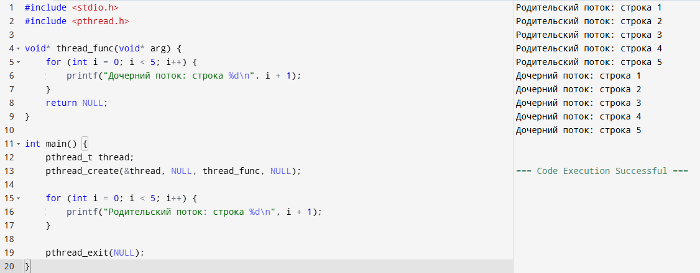
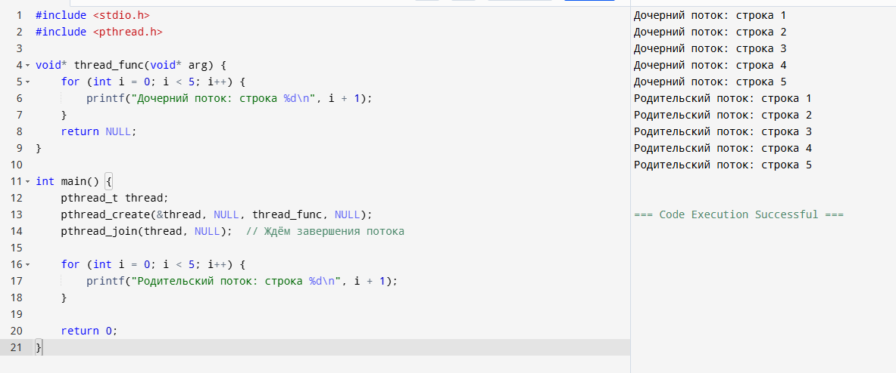
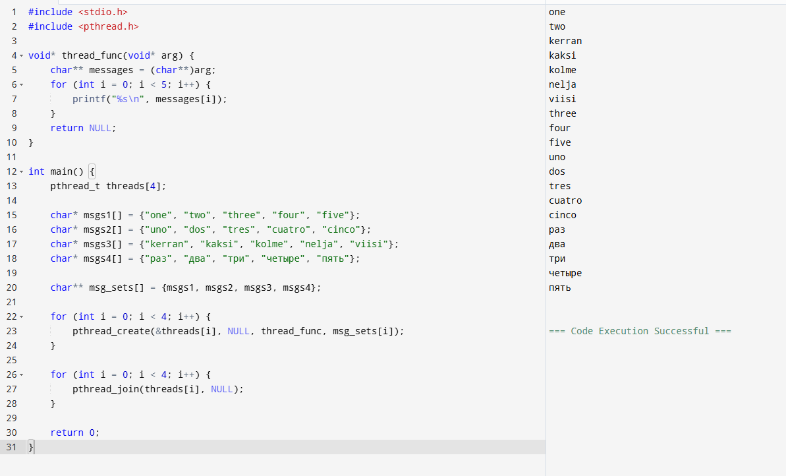
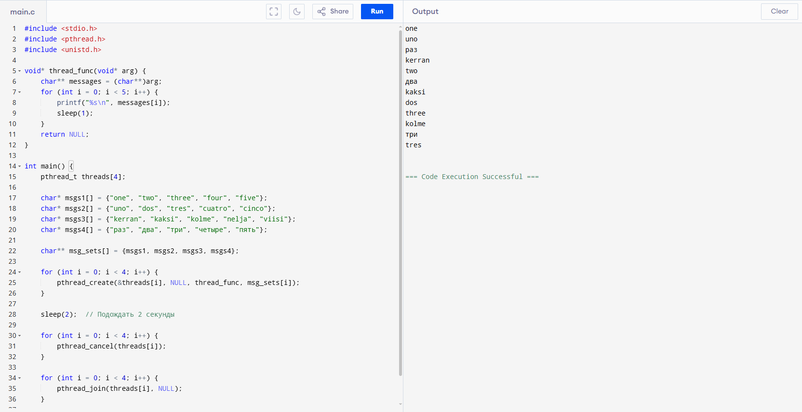
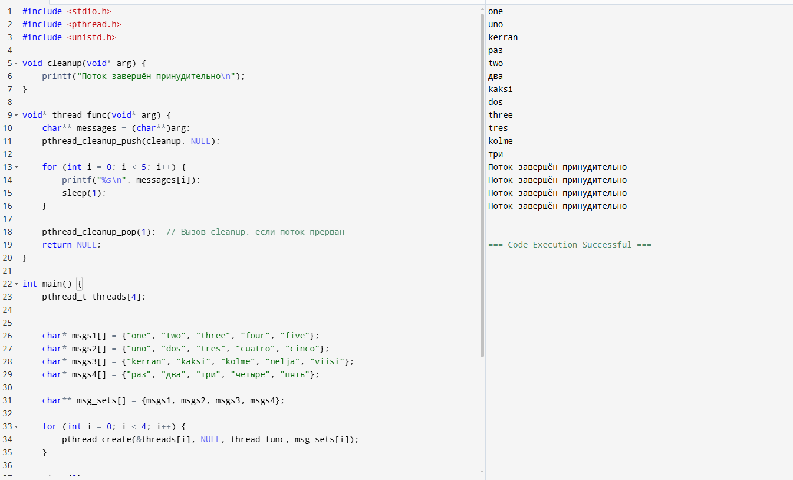
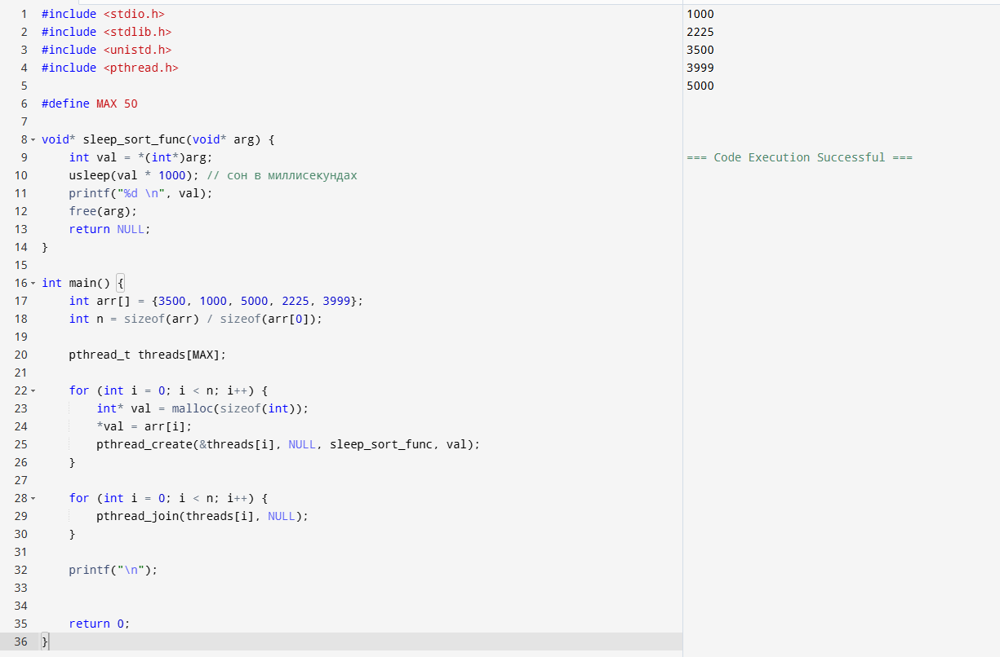
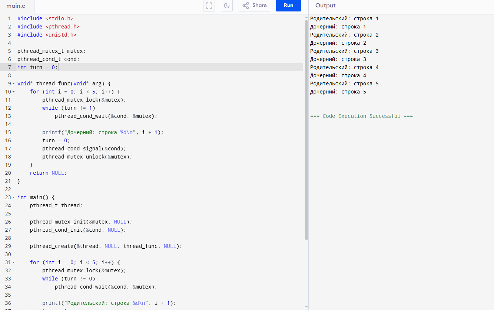
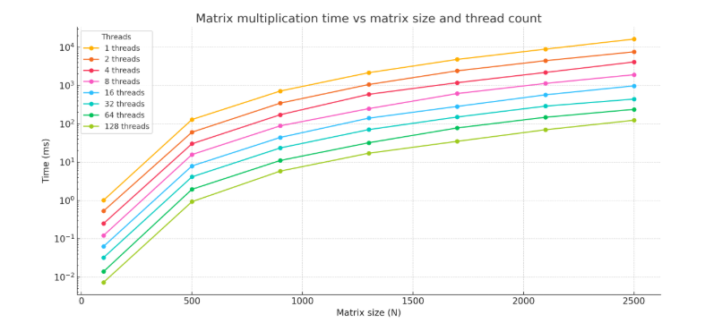

# Оценка 3

Создали программу, которая создает родительский и дочерний поток

Модифицировали упр.1

Модифицировали упр.2 так, чтобы создавалось 4 потока

Добавили sleep() между выводами строк

Добавили сообщение о завершении дочернего потока

Реализовали Sleepsort с массивом из 5 элементов, представляющих кол-во миллисекунд.

# Оценка 4

Модифицировали программу из упр.5 так, чтобы вывод родительского и дочернего потока были синхронизированы в поочередном выводе строк

График замера времени  выполнения с момента создания потоков и до завершения их работы. Использовались значения потоков от 1 до 128, размер матриц до 2500

